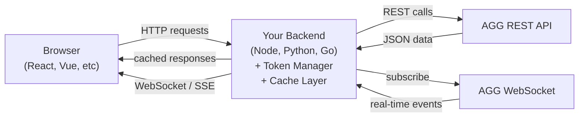
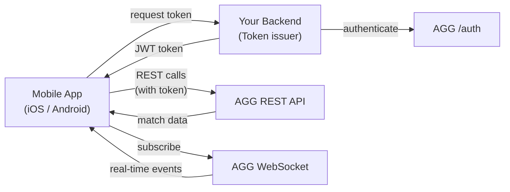
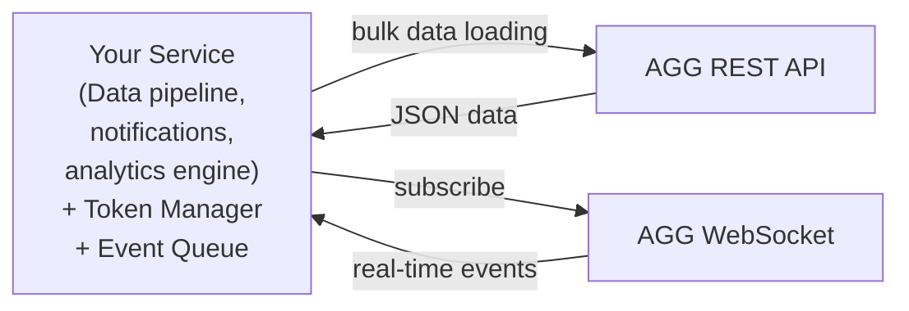

This page describes common integration patterns for connecting your application to AGG's [REST](/rest-api) and [WebSocket](/websocket) APIs. Choose the pattern that best fits your platform.

---

## Pattern 1: Web Application (Backend Proxy)

**Best for:** Web dashboards, sports portals, analytics platforms

Your backend server handles authentication and proxies AGG data to the browser. This keeps credentials secure and lets you add caching.

<Frame>

</Frame>

<Steps>
  <Step title="Authenticate">
    Your backend authenticates with AGG (`POST /auth/token` via HMAC signature) and manages token lifecycle.
  </Step>
  <Step title="Request Data">
    Browser requests data from your backend.
  </Step>
  <Step title="Fetch & Cache">
    Your backend fetches from AGG REST API, caches responses, and returns to browser.
  </Step>
  <Step title="Real-time Stream">
    For real-time: your backend connects to AGG WebSocket and forwards events to the browser via your own WebSocket or SSE.
  </Step>
</Steps>

<Info>
This pattern is recommended for most web applications. It keeps your AGG credentials on the server side and lets you control caching and rate limit usage.
</Info>

### Implementation Tips

- Cache `/sports` and `/leagues` responses for 24 hours
- Use a single AGG WebSocket connection and subscribe to `matches:live` for the dashboard, `match:{id}` for detail views
- Forward only relevant events to each browser client to minimize bandwidth

---

## Pattern 2: Mobile Application (Direct)

**Best for:** iOS/Android apps with a lightweight backend

Mobile apps can connect directly to AGG for both REST and WebSocket, with your backend providing the JWT token.

<Frame>

</Frame>

<Steps>
  <Step title="Provide Token">
    Your backend authenticates with AGG and provides the JWT token to the mobile app via a secure endpoint.
  </Step>
  <Step title="Direct REST Calls">
    The mobile app uses the token to call AGG REST API directly.
  </Step>
  <Step title="Direct WebSocket Connection">
    The mobile app connects to AGG WebSocket directly for real-time updates.
  </Step>
</Steps>

<Warning>
Never embed your `merchant_secret` in the mobile app. Always use your backend as a token broker — HMAC signing must happen server-side.
</Warning>

### Implementation Tips

- Store the JWT token securely (Keychain on iOS, EncryptedSharedPreferences on Android)
- Implement token refresh before expiry to avoid interruptions during live matches
- Use a single WebSocket connection per app instance — subscribe to multiple channels on one connection

---

## Pattern 3: Backend-to-Backend

**Best for:** Data pipelines, analytics engines, notification services

Your server connects directly to AGG without any frontend involvement.

<Frame>

</Frame>

<Steps>
  <Step title="Direct Authentication">
    Your service authenticates directly with AGG.
  </Step>
  <Step title="Bulk Data Loading">
    Use REST API for bulk data loading and historical queries.
  </Step>
  <Step title="Event Ingestion">
    Use WebSocket for real-time event ingestion into your pipeline.
  </Step>
</Steps>

### Implementation Tips

- Implement connection pooling if monitoring many matches (up to 50 WebSocket connections per merchant)
- Use an internal message queue (Redis, RabbitMQ, Kafka) to decouple AGG event ingestion from downstream processing
- Monitor rate limits — backend services tend to make more API calls than frontend apps

---

## Choosing a Pattern

| Factor | Backend Proxy | Mobile Direct | Backend-to-Backend |
|--------|--------------|---------------|-------------------|
| **Credential security** | Excellent — server only | Good — token broker | Excellent — server only |
| **Caching** | Easy to add | Per-device only | Easy to add |
| **WebSocket connections** | One per your server | One per device | Controlled by you |
| **Rate limit usage** | Efficient (shared cache) | Per-device calls | Highest volume |
| **Latency** | +1 hop (your backend) | Direct to AGG | Direct to AGG |
| **Best for** | Web apps, portals | Mobile apps | Data pipelines |

## Common Considerations

### Token Management

All patterns require token management. See [Authentication](/authentication#token-refresh-pattern) for the recommended TokenManager pattern and security best practices.

### Rate Limits

Your rate limit budget is shared across all connections and patterns. If you have both a web backend and a mobile app calling AGG, they share the same merchant rate limit. See [Rate Limits](/rate-limits) for details.

### Failover

For production applications, implement fallback from WebSocket to REST polling. See [WebSocket Overview](/websocket#rest-polling-fallback) for the recommended approach.

## Related Pages

<CardGroup cols={2}>
  <Card title="Authentication" icon="lock" href="/authentication">
    HMAC signing, token lifecycle, and security best practices
  </Card>
  <Card title="WebSocket API" icon="wifi" href="/websocket">
    Real-time connection patterns and subscription model
  </Card>
  <Card title="Rate Limits" icon="gauge" href="/rate-limits">
    Request budgets and throttling behavior
  </Card>
  <Card title="Common Use Cases" icon="book" href="/guides/common-use-cases">
    End-to-end examples for dashboards, match detail, and streams
  </Card>
</CardGroup>
